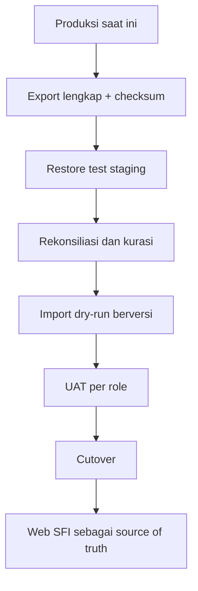

# Laporan Audit dan Roadmap Perbaikan Sistem SFI

Tanggal audit: 21 Juli 2026  
Tujuan: memastikan data aman diekspor, dikurasi, diimpor ulang, dan seluruh fungsi operasional dapat dikelola dari frontend tanpa membuka risiko keamanan.

## 1. Keputusan utama

[Pasti] Sistem **belum aman di-reset**. Urutan yang benar adalah:

1. Bangun export/backup lengkap dan uji restore.
2. Ekspor seluruh data produksi beserta histori dan manifest.
3. Rekonsiliasi sistem vs Excel dan kurasi konflik kritis.
4. Bangun importer berversi dengan dry-run dan idempotency.
5. Uji di staging, lakukan UAT per role, lalu cutover.

Menambah fitur sebelum langkah 1–3 dapat memperbesar data yang tidak bisa dipulihkan.

## 2. Ruang lingkup dan kualitas bukti

### Berhasil diaudit

- `SFI_MASTER_TERNAK_v3(1).xlsx`: 10 sheet, 64 indukan, 102 anakan.
- `Pasted markdown.md`: gap analysis Excel vs codebase.
- `REKOMENDASI_SISTEM_SFI(1).md`: rekomendasi teknis dan roadmap AI sebelumnya.
- `LAPORAN_ANALISA_SFI.md`: laporan analisa peternakan.

### Tidak dapat diaudit

Tiga file berikut 0 byte:

- `IMPORT_TERNAK_SFI_siap_upload(1).xlsx`.
- `INSTRUKSI_GAP_ANALYSIS_LANJUTAN(1).md`.
- `Pasted markdown (2)(1).md`.

[Pasti] Karena template upload aktual kosong, kesiapan mapping ke importer web tidak dapat divalidasi. Template final harus dibuat ulang dari schema/API importer aktual, bukan ditebak.

### Belum tersedia

- Repository/source code aktif dan commit yang sedang dipakai.
- Database schema/migration lengkap dan dump anonim.
- Daftar route, queue, scheduler, policy, observer, test, dan setting aktif.
- Screen recording seluruh menu untuk Owner, Breeder, Staff, dan Mitra.
- Contoh export, proforma, invoice, pembayaran, pembatalan, dan laporan dari sistem.

Akibatnya, klaim tentang backend saat ini diklasifikasikan sebagai belum terverifikasi sampai gap analysis lanjutan membaca artefak tersebut.

## 3. Temuan data yang sudah pasti

| Temuan | Hasil |
|---|---:|
| Record indukan | 64 |
| Record anakan | 102 |
| Anakan hidup / mati | 101 / 1 |
| Total ternak hidup | 165 |
| Kejadian kelahiran teridentifikasi | 71 |
| BB lahir aktual / asumsi | 90 / 12 |
| Nomor sementara indukan / anakan | 6 / 5 |
| Rantai eartag tanpa tag final | 4 |
| Link Google Drive terisi | 0 |
| Ketidaksinkronan `IND JENIS` vs master induk | 13 |
| Interval kelahiran di bawah 150 hari | 5 |

### 3.1 Formula workbook yang rusak

1. `ANAKAN!R6:R107` menghitung usia menggunakan `$Q$3`, sementara tanggal acuan berada di `$R$3`. Seluruh usia menjadi sekitar `-1530` bulan.
2. `REKAP!B15` mencari label status pada kolom usia `R`, bukan kolom status `S`.
3. `REKAP!B24` menghitung F1 dari `IND JENIS` kolom `J`, bukan `GENERASI` kolom `K`; hasilnya 29, sedangkan data deklaratif generasi F1 berjumlah 57.
4. Sheet `LAPORAN ANALISA` berisi angka statis, bukan formula. Perubahan data master tidak otomatis memperbarui laporan.

Konsekuensi: nilai `USIA`, `STATUS TERNAK`, rekap status, dan sebagian rekap generasi tidak boleh diimpor sebagai fakta.

### 3.2 Klaim interval kelahiran 133 hari tidak sah

Lima pasangan event menghasilkan interval mustahil:

| Induk | Event 1 | Event 2 | Interval |
|---|---|---|---:|
| 061 | 25 Mei 2026 | 28 Mei 2026 | 3 hari |
| 161 | 18 Nov 2025 | 24 Nov 2025 | 6 hari |
| 160 | 16 Nov 2025 | 27 Nov 2025 | 11 hari |
| 171 | 27 Okt 2025 | 22 Nov 2025 | 26 hari |
| 174 | 2 Nov 2025 | 9 Des 2025 | 37 hari |

[Pasti] Rata-rata 133 hari tercemar oleh lima konflik ini dan tidak boleh ditampilkan sebagai KPI. Dokumen pemerintah Queensland menggunakan masa kebuntingan sekitar 21 minggu, sedangkan sumber FAO untuk Asia Tenggara menyebut interval 6 bulan dapat dicapai dengan manajemen cermat dan 8–9 bulan lebih lazim. Karena itu, interval 3–37 hari jelas menunjukkan salah tanggal, salah induk, atau penggabungan event yang keliru.

Tindakan: verifikasi bukti WhatsApp/foto, tanggal, dan induk untuk record terkait sebelum KPI reproduksi diaktifkan.

### 3.3 KPI reproduksi lama belum memenuhi definisi cohort

- `102 ÷ 64 = 159%` bukan lambing rate yang sah bila 64 bukan jumlah induk yang benar-benar dikawinkan/exposed pada periode yang sama.
- `59 ÷ 64 = 92,2%` bukan fertility rate yang sah tanpa data kawin/cohort dan outcome.
- Prolificacy `102 ÷ 71 = 1,44` secara definisi lebih masuk akal karena memakai anak per partus, tetapi tetap perlu memperhitungkan lahir hidup, stillborn, dan event yang sudah dikurasi.
- Angka pembanding industri pada rekomendasi lama tidak boleh dijadikan target frontend sampai sumber dan konteks breed/sistem pemeliharaan ditetapkan.

Sistem perlu menyimpan denominator dan cohort setiap KPI, bukan hanya hasil persentase.

### 3.4 Populasi 165 vs 166 harus dipisahkan

- 166 = seluruh record: 64 indukan + 102 anakan termasuk 1 mati.
- 165 = ternak hidup/aktif: 64 + 101.

Laporan harus selalu memberi label: `total records`, `active/live inventory`, `dead`, `sold`, `transferred`, dan `culled`.

### 3.5 Workbook belum menyimpan data pejantan

[Pasti] Seluruh 102 anakan hanya memiliki referensi induk betina. Aturan generasi terbaru bergantung pada kelas pejantan, sehingga generasi F1/F2/F3/PURE di workbook saat ini harus diperlakukan sebagai `declared_generation`, bukan hasil kalkulasi terverifikasi.

## 4. Koreksi terhadap gap analysis dan rekomendasi lama

### 4.1 Menambah 9–15 kolom ke `animals` belum cukup

Desain yang lebih aman:

- `animals`: identitas stabil, tag aktif, breed/gender, pemilik, tanggal lahir, status hidup.
- `birth_events`: satu record per partus; dam, sire, tanggal/waktu, lokasi, jumlah lahir, hidup, mati lahir, bantuan kelahiran, bukti media, confidence.
- `animal_birth_event_members`: menghubungkan satu birth event ke setiap anak.
- `weight_logs`: bobot dengan tipe `BIRTH`, `WEANING`, `MATING`, `ROUTINE`, dan flag estimasi.
- `animal_tag_history`: seluruh pergantian tag, efektif dari/hingga, alasan, bukti.
- `animal_status_history`: perubahan status fisik/reproduksi/lokasi/kepemilikan.
- `data_quality_issues`: masalah, severity, owner, bukti, status, resolution.

`litter_size`, `total_siklus`, `jumlah anakan`, dan `jenis induk` sebaiknya diturunkan dari event/relasi, bukan menjadi input manual berulang pada setiap anak.

### 4.2 Filter `partner_id` bukan solusi otomatis untuk HPP

Saya tidak setuju dengan rekomendasi lama yang menganggap biaya harus difilter per pemilik karena alasan berikut: siapa yang menanggung biaya merupakan aturan kontrak, sedangkan siapa yang mengonsumsi biaya merupakan dasar alokasi. Keduanya berbeda.

Ini yang harus dilakukan sebagai gantinya: bangun `cost pool` dan `allocation policy` yang dapat dipilih dari frontend:

- Penanggung ekonomi: SFI, mitra tertentu, bersama, atau ditentukan kontrak.
- Penerima alokasi: ternak individual, kandang, kelompok, pemilik, dam-litter unit, atau seluruh farm.
- Basis: direct actual, animal-days, headcount, bobot hidup, bobot metabolis, jumlah konsumsi aktual, atau persentase manual.
- Periode: tanggal transaksi atau cutoff bulanan.
- Pengecualian: ternak mati/terjual, lahir di tengah periode, cempe menyusu, dan stok tidak terpakai.

Risiko pendekatan lama adalah biaya tetap dapat salah meskipun sudah diberi `partner_id`, terutama bila ternak beberapa pemilik makan dari cost pool yang sama atau kontrak menyatakan SFI menanggung biaya tertentu.

### 4.3 “Semua backend dipindah ke frontend” berbahaya

Yang boleh dikelola Super Admin dari frontend:

- Role dan permission berbasis modul/aksi/scope.
- Master data, label, bahasa, satuan, kategori usia, rule generasi, eartag, kandang.
- Metode HPP, cutoff, report template, tampilan dashboard, urutan widget, gambar, konten, logo, warna, dan feature flag bisnis.

Yang tidak boleh diekspos:

- Password database, API secret, encryption key, SMTP credential, token Google Drive.
- Raw SQL, arbitrary PHP/code execution, filesystem path server, queue internals tanpa guardrail.
- Pengaturan keamanan/deployment yang dapat mematikan audit, backup, atau autentikasi.

Semua setting bisnis harus versioned, memiliki effective date, preview dampak, audit log, permission, dan rollback.

### 4.4 Aturan generasi lama bertentangan dengan aturan terbaru

Rule baru yang harus menjadi source of truth:

| Sire | Dam | Hasil otomatis |
|---|---|---|
| Fullblood | Lokal/Garut/Cross/Merino/Texel | F1 |
| Fullblood | F1 | F2 |
| Fullblood | F2 | F3 |
| Fullblood | Fn | F(n+1) |
| Fullblood | Fullblood/Pure | perlu keputusan studbook: PURE atau FULLBLOOD |
| Bukan fullblood | generasi apa pun | CROSS DORPER |
| Tidak diketahui | apa pun | PENDING CONFIRMATION; jangan menebak |

Simpan sekaligus `declared_generation`, `calculated_generation`, `rule_version`, `sire_confidence`, dan alasan override.

## 5. Target arsitektur fungsional

Prinsip:

- Satu UUID internal per ternak; eartag dapat berubah dan tidak menjadi primary key.
- Semua perubahan penting disimpan sebagai event/history, bukan menimpa tanpa jejak.
- Setiap import/export mempunyai `schema_version`, `exported_at`, source, row count, checksum, dan reconciliation result.
- Operasi bulk harus transactional atau dapat dilanjutkan/diulang tanpa duplikasi.
- Web dan HP memakai API/business rule yang sama.

## 6. Urutan implementasi yang direkomendasikan

### Release 0 — Data safety dan export sebelum reset

1. Backup database + metadata storage + konfigurasi nonrahasia.
2. Restore test ke staging.
3. Export Center di frontend:
   - filter modul, pemilik, status, kandang, periode, updated-at;
   - output XLSX, CSV, dan JSON untuk data;
   - ZIP full export untuk backup portabel;
   - manifest, schema, stable IDs, checksum, dan error report.
4. Export harus mencakup seluruh histori: tag, pemilik, lokasi, status, bobot, kesehatan, kawin, kelahiran, kematian/exit, inventory, HPP, penjualan, pembayaran, media link, setting versions, dan audit log.
5. Import Center: template download, mapping, preview, dry-run, issue report, commit, rollback batch, dan idempotency.

Definition of done:

- Backup berhasil direstore.
- Count dan relasi export sama dengan database snapshot.
- Import dua kali tidak menggandakan record/history.
- Tidak ada orphan parent/event dan tidak ada password/token dalam export.

### Release 1 — Kurasi data dan quick wins frontend

1. Data Quality Inbox menggantikan `PERLU KONFIRMASI`.
2. Task nomor eartag sementara dengan referensi birth event, urutan kelahiran, tanggal/jam, dam, foto/WA reference, owner, aging, dan notifikasi.
3. Tambah media URL pada template dan form bulk update.
4. Rule kategori umur berversi di frontend:
   - `0 ≤ usia < 3`: CEMPE;
   - `3 ≤ usia < 5`: CEMPE SAPIH;
   - `5 ≤ usia < 8`: DARA/BAKALAN;
   - `usia ≥ 8`: BETINA INDUKAN/JANTAN.
5. Pisahkan `age_category` dari `reproductive_status`.
6. Role & Permission Builder dengan scope `own`, `partner`, `location`, `all`.
7. Report Center dengan filter periode dan pemilik, pemilihan kolom/KPI, preview, saved view, export XLSX/CSV/PDF; PPTX/PNG untuk laporan presentasi yang sudah memiliki template.

### Release 2 — Sales dan HPP ledger

#### Sales state machine

`DRAFT → PROFORMA_SENT → RESERVED → PARTIALLY_PAID → PAID/COMPLETED`

Cabang: `EXPIRED`, `CANCELLED`, `REFUNDED`.

Kebutuhan:

- Search/filter tag, pemilik, kandang, kategori, breed, gender, bobot, status, HPP.
- Bulk select, preview stok, harga default HPP/price list/manual, diskon, pajak, ongkir.
- Proforma PDF dengan nomor dan masa berlaku.
- Reservation/stock hold dengan expiry dan pencegahan double sale.
- Multiple/partial payments, DP, bukti bayar, saldo, pelunasan.
- Invoice hanya pada trigger yang disepakati; cancellation melepaskan stok secara transactional.
- Credit note/refund bila transaksi selesai harus dibalik.
- Audit semua override harga dan status.

#### HPP ledger

- Penerimaan inventory: item, batch, expiry, qty, unit, unit cost, supplier.
- Pemakaian: tanggal, lokasi/kelompok/animal, qty, unit conversion, petugas.
- Cost pool dan allocation policy berversi.
- Cutoff bulanan berstatus `DRAFT → REVIEWED → POSTED → LOCKED`.
- Preview sebelum posting, reconciliation ke inventory usage, dan reversal; tidak mengedit posted ledger diam-diam.
- Historical HPP per ternak per bulan dan drill-down sampai transaksi sumber.

### Release 3 — Reproduksi, histori, dashboard, dan operasional

- Model birth event dan sire inference dengan confidence; jangan auto-confirm.
- Validasi kawin/inbreeding hanya setelah data sire cukup.
- KPI reproduksi berbasis cohort dan snapshot definisi.
- Dashboard historical menggunakan event log/as-of date, bukan current table saja.
- PWA/offline queue untuk kelahiran, timbang, obat, pakan; conflict handling dan sync status.
- Program kesehatan preventif dan withdrawal period.
- Dashboard/widget builder dan theme/content manager dengan guardrail.

## 7. Acceptance criteria lintas modul

- Permission diuji server-side, bukan hanya menyembunyikan tombol.
- Setiap perubahan setting memiliki who/when/before/after/reason/effective date.
- Semua list besar memiliki search, filter, sort, pagination, saved view, dan bulk action yang aman.
- Export memakai snapshot konsisten dan mencantumkan filter, periode, timezone Asia/Jakarta, generated-at, serta source version.
- PDF/PPT/PNG dirender dari report definition yang sama agar angka tidak berbeda.
- Semua nominal menggunakan decimal, bukan float.
- Semua tanggal tersimpan dengan timezone yang jelas; laporan memakai Asia/Jakarta.
- Test minimum: unit rule, integration, permission, import idempotency, export reconciliation, state transition, rollback, dan mobile UAT.

## 8. Data tambahan yang wajib diminta

### P0 — sebelum coding/reset

- Source code/repository aktif.
- Database schema dan dump anonim.
- Template upload aktual non-kosong.
- Export produksi saat ini.
- Screen recording per role.
- Daftar seluruh setting/hard-coded constant.
- Data bukti untuk lima interval konflik dan sebelas nomor sementara.

### P1 — sebelum HPP/sales selesai

- Kontrak kemitraan dan definisi penanggung biaya/bagi hasil.
- Kebijakan harga, diskon, pajak, ongkir, DP, pembatalan, refund.
- Unit inventory, konversi, batch, expiry, dan contoh transaksi.
- Contoh proforma, invoice, laporan mitra, dan laporan eksternal.

### P2 — operasional

- Versi PHP/MySQL, cron, queue, backup policy, deploy/runbook, monitoring.
- Kebijakan retention, privacy, siapa boleh melihat HPP/pemilik/media.
- Bahasa/label final dan desain brand SFI.

## 9. Hal yang tidak boleh dilakukan sekarang

- Reset produksi sebelum restore test dan export reconciliation lulus.
- Mengimpor nilai usia/status dari formula workbook lama.
- Menghitung ulang generasi tanpa data pejantan.
- Menjalankan recompute HPP historis tanpa simulasi before/after dan keputusan kontrak.
- Membuka credential atau raw backend control ke frontend.
- Mengubah struktur produksi besar sekaligus tanpa migration batch, feature flag, dan rollback.

## 10. Sumber eksternal untuk koreksi metodologi

- Queensland Government, joining sheep dan gestasi 21 minggu: https://www.business.qld.gov.au/industries/farms-fishing-forestry/agriculture/animal/industries/sheep/breeding/joining-length
- FAO, interval lambing Asia Tenggara: https://www.fao.org/4/x6517e/x6517e04.htm
- FAO, definisi prolificacy/litter size: https://www.fao.org/4/x5460e/x5460e02.htm
- W3C WCAG 2.2 target size: https://www.w3.org/WAI/WCAG22/Understanding/target-size-minimum

