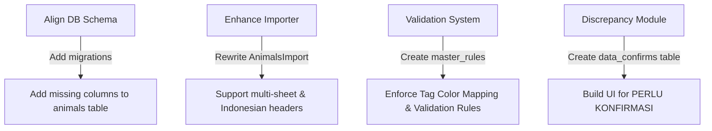

# Gap Analysis: SFI Master Ternak Excel vs. Laravel Codebase

This document analyzes the worksheets, columns, and data rules inside `SFI_MASTER_TERNAK_v3.xlsx` and compares them to the current Laravel codebase database migrations and Eloquent models to identify data structure, business logic, and functional gaps.

---

## 1. Worksheet-by-Worksheet Analysis of `SFI_MASTER_TERNAK_v3.xlsx`

The master spreadsheet contains 10 worksheets, organized as follows:

| Worksheet Name | Purpose / Type of Data | Row Starts | Primary Identifiers / Keys |
| :--- | :--- | :---: | :--- |
| **`PETUNJUK`** | Operational guide and cell color coding guidelines. | - | N/A |
| **`LAPORAN ANALISA`** | Executive text summary and analysis of herd dynamics from Sep 2025 – Jul 2026. | - | N/A |
| **`REKAP`** | Excel formulas summarising populations and financial valuations per owner. | - | Owner (FAHRI, OKI, SFI, etc.) |
| **`INDUKAN`** | Main database for breeding females (Dams) with detailed lineage, weight, and history. | Row 5 | `TAG FINAL` / `NOMOR` |
| **`ANAKAN`** | Main database for offspring (Lambs/Cempe) with birth detail, mother link, and condition. | Row 5 | `TAG FINAL` / `NOMOR AKTIF` |
| **`HISTORI EARTAG`** | Historical tracking of ear tag changes (e.g. tag losses, replacements). | Row 4 | `TAG LAMA` -> `TAG BARU` / `TAG FINAL` |
| **`FOLDER GDRIVE`** | Google Drive folder hierarchy structure (used by a Google Apps Script). | Row 4 | `PATH LENGKAP` |
| **`PERLU KONFIRMASI`** | Active log of data validation conflicts and missing details awaiting resolution. | Row 4 | `TAG` |
| **`KELAHIRAN AWAL`** | Summary/aggregate records of births from Jan – Jul 2025 (pre-dating detailed databases). | Row 4 | Date (`TANGGAL`) |
| **`REFERENSI`** | Mapping reference rules matching Breed/Generation types to Ear Tag Colors. | Row 3 | `JENIS` -> `WARNA EARTAG` |

---

## 2. Column-Level Schema Mapping & Gaps

We compared the columns present in the core data sheets (`INDUKAN` and `ANAKAN`) with the database schema defined in the migration files for the `animals` table:

### A. Sheet: `INDUKAN` (Dams)
This sheet contains records of mature female animals.

| Excel Column Name | Database Destination / Mapping | Status / Gap | Description / Notes |
| :--- | :--- | :---: | :--- |
| `NO` | *N/A* | - | Row counter |
| `TAG FINAL` | `animals.tag_id` | Match | The active eartag code. |
| `NOMOR` | *No direct mapping* | **Gap** | Secondary local identifier (often matches `TAG FINAL`). |
| `TAG LAMA` | `animal_ear_tag_logs.old_tag_id` | Match (Log) | Handled historically in logs, but not directly in `animals`. |
| `PEMILIK` | `animals.partner_id` or `animals.owner_id` | Match | Maps to user or partner (e.g., FAHRI, OKI, SFI). |
| `JENIS` | `animals.generation` | Match | e.g. F1, F2, F3, lokal, etc. |
| `BREED (SISTEM)` | `animals.breed_id` | Match | Maps to `master_breeds.name` (e.g. F1 DORPER). |
| `JENIS KELAMIN` | `animals.gender` | Match | Casts to enum `BETINA`. |
| `CIRI FISIK` | *No mapping* | **Critical Gap** | Description of physical appearance (e.g., *Full Blackhead, white spots*). |
| `TGL LAHIR` | `animals.birth_date` | Match | Date of birth. |
| `USIA (BLN)` | *Calculated* | Match | Derived dynamically in code or via accessor `getAgeStringAttribute()`. |
| `BB (KG)` | `weight_logs.weight_kg` | Match (Relational) | Stored as weight logs rather than a static column on `animals`. |
| `HARGA (Rp)` | `animals.purchase_price` | Match | Acquisition price. |
| `KANDANG` | `animals.current_location_id` | Match | Maps to `master_locations.name` (e.g. Kandang Koloni 1). |
| `TOTAL SIKLUS` | *No mapping* | **Gap** | Number of breeding/pregnancy cycles. Code has no column to store this. |
| `TOTAL ANAKAN` | *Calculated* | Match | Can be computed dynamically using the `offspring()` relation. |
| `ANAKAN HIDUP` | *Calculated* | Match | Computed dynamically using offspring condition filters. |
| `ANAKAN MATI` | *Calculated* | Match | Computed dynamically using offspring condition filters. |
| `LINK FOTO/VIDEO` | `animals.google_drive_link` | Match | Stores Drive folder URL or media link. |
| `SUMBER` | *No mapping* | **Gap** | Record data source (e.g., "file mitra"). No DB field tracks record source. |
| `PERLU DILENGKAPI` | *No mapping* | **Gap** | Custom data correction notes. |
| `ANAKAN TERKAIT` | *No mapping* | **Gap** | Notes linking offspring. |

---

### B. Sheet: `ANAKAN` (Offspring/Cempe)
This sheet contains records of young animals born on the farm.

| Excel Column Name | Database Destination / Mapping | Status / Gap | Description / Notes |
| :--- | :--- | :---: | :--- |
| `NO` | *N/A* | - | Row counter |
| `TGL LAHIR` | `animals.birth_date` | Match | Date of birth. |
| `TAG FINAL` | `animals.tag_id` | Match | Active eartag code. |
| `NOMOR AKTIF` | *No direct mapping* | **Gap** | Similar to `NOMOR` in Indukan. |
| `TAG LAMA` | `animal_ear_tag_logs.old_tag_id` | Match (Log) | Historical tag logs. |
| `TAG BARU` | `animal_ear_tag_logs.new_tag_id` | Match (Log) | Historical tag logs. |
| `KEMBAR` | *No mapping* | **Critical Gap** | Litter size at birth (e.g., 1=Single, 2=Twins, 3=Triplets). **No field in DB**. |
| `IND NOMOR` | *No direct mapping* | **Gap** | Secondary local identifier of mother. |
| `IND TAG FINAL` | `animals.dam_id` | Match (Relational) | Links to the dam (mother) record in `animals` (UUID). |
| `IND JENIS` | *No mapping* | Match (Derived) | Mother's generation (derivable via `dam->generation`). |
| `GENERASI` | `animals.generation` | Match | Generation code (e.g. F2). |
| `BREED (SISTEM)` | `animals.breed_id` | Match | Maps to `master_breeds.name` (e.g., F2 DORPER). |
| `JENIS KELAMIN` | `animals.gender` | Match | Casts to enum `JANTAN` or `BETINA`. |
| `KONDISI` | `animals.health_status` | Match (Partial) | maps "Hidup" -> `SEHAT` and "Mati" -> `MATI`. |
| `BB LAHIR` | *No mapping* | **Critical Gap** | Explicit birth weight field. Stored only in `weight_logs`, not isolated. |
| `BB ASUMSI?` | *No mapping* | **Gap** | Flag indicating if birth weight is an estimate. |
| `KALUNG` | `animals.necklace_color` | Match | Necklace color indicator. |
| `USIA (BLN)` | *Calculated* | Match | Calculated dynamically in model. |
| `STATUS TERNAK` | `animals.current_phys_status_id` | Match (Partial) | Dynamic Excel formula based on gender and age. Code lacks automation. |
| `HARGA (Rp)` | `animals.purchase_price` or value | Match | Estimated asset value. |
| `KANDANG` | `animals.current_location_id` | Match | Location mapping. |
| `PEMILIK` | `animals.partner_id` / `owner_id` | Match | Owner mapping. |
| `DI FILE MITRA` | *No mapping* | **Gap** | Flag indicating if the record is present in partner logs. |
| `LINK FOTO/VIDEO` | `animals.google_drive_link` | Match | Drive folders/photos link. |
| `KEYAKINAN` | *No mapping* | **Gap** | Data confidence rating ('tinggi', 'sedang', 'rendah'). |
| `PERLU DILENGKAPI` | *No mapping* | **Gap** | Validation todo notes. |
| `CATATAN` | *No mapping* | **Gap** | General text notes/observations for the animal. |

---

## 3. Key Gaps Identified

### Gap 1: Missing Critical Database Columns in `animals` Table
To capture the exact datasets from the Excel sheets, the database `animals` schema is missing these fields:
1. **`physical_description` / `ciri_fisik`** (`TEXT`, nullable): Stores physical traits.
2. **`litter_size` / `kembar`** (`TINYINT`, default 1): Tracks whether the animal was born as a single, twin, triplet, etc.
3. **`birth_weight` / `bb_lahir`** (`DECIMAL(5,2)`, nullable): Explicit birth weight storage. While it is written to `weight_logs`, not having a dedicated field makes it difficult to run reports comparing birth weight to subsequent weights directly from the `animals` table.
4. **`is_birth_weight_estimated` / `bb_asumsi`** (`BOOLEAN`, default false): Establishes whether the birth weight is estimated.
5. **`confidence_level` / `keyakinan`** (`ENUM('RENDAH', 'SEDANG', 'TINGGI')`, default 'TINGGI'): Tracks pedigree confidence.
6. **`source` / `sumber`** (`STRING`, nullable): Tracks the origin of the record (e.g., 'file mitra', 'catatan tangan').
7. **`notes` / `catatan`** (`TEXT`, nullable): Stores general notes and instructions.
8. **`is_in_partner_records` / `di_file_mitra`** (`BOOLEAN`, default false): Tracks offline matching status.
9. **`breeding_cycles_count` / `total_siklus`** (`TINYINT`, nullable): Stores total breeding cycles for dams.

### Gap 2: Spreadsheet Import Incompatibility (`AnimalsImport.php`)
The current excel import script (`AnimalsImport.php`) was built for a simple flat template (`template_ternak_sfi.xlsx`) and will fail to process `SFI_MASTER_TERNAK_v3.xlsx` due to:
* **Multiple Sheets**: It does not split row processing between `INDUKAN` and `ANAKAN` sheets.
* **Heading Index**: The import reads headers from row 1, whereas data in these sheets starts at row 5 (header at row 4).
* **Column Mismatch**: Excel headers are in Indonesian/capitalized (e.g. `TAG FINAL`, `BREED (SISTEM)`, `PEMILIK`), while the importer expects english snake_case labels (`tag_id`, `breed_name`, `partner_name`).
* **Relational Linking**: The importer doesn't resolve parent links (`dam_id` linked via `IND TAG FINAL`) during import.

### Gap 3: Google Drive Folder Structure Sync (`FOLDER GDRIVE` Sheet)
* The spreadsheet references a script `BUAT_FOLDER_GDRIVE.gs` used to generate folder structures dynamically for animals based on their tag number.
* The codebase only contains a static `google_drive_link` URL column on the animal model, without any API automation or script execution tools to create folders or link them programmatically.

### Gap 4: Data Quality & Discrepancy Logger (`PERLU KONFIRMASI` Sheet)
* The spreadsheet tracks operational data disputes (e.g. missing gender, tag replacement conflicts).
* The Laravel system lacks a dedicated database table or UI to track data quality issues, log conflicts, or request inputs from Mitra/Breeder users.

### Gap 5: Historical Aggregate Birth Log (`KELAHIRAN AWAL` Sheet)
* This sheet logs historical aggregate birth counts without individual tag detail (e.g., 3 lambs born on a date with no ID).
* The database only allows adding fully-formed animal records. There is no aggregate history table or dashboard display for this early transition data.

### Gap 6: Ear Tag Color Rules Validation (`REFERENSI` Sheet)
* The spreadsheet defines a rule-based validation linking Breed type / Generation to specific Ear Tag Colors (e.g. F2 -> Orange).
* The codebase handles ear tag colors as arbitrary text fields in `FarmSetting` without correlation rules or frontend validations.

---

## 4. Recommendations for Closure

To fully support the features and structure in `SFI_MASTER_TERNAK_v3.xlsx`, the following development items are recommended:

### Phase 1: Database Schema Expansion (Migrations)
Create a new migration to add the missing fields to the `animals` table:
* `ciri_fisik` (string)
* `kembar` (integer)
* `bb_lahir` (decimal)
* `bb_asumsi` (boolean)
* `keyakinan` (enum)
* `sumber` (string)
* `catatan` (text)
* `di_file_mitra` (boolean)
* `total_siklus` (integer)

### Phase 2: Refactoring Excel Import
Rewrite `AnimalsImport.php` using Maatwebsite Excel's `WithMultipleSheets` concern. Add logic to:
1. Parse the `INDUKAN` sheet and load mature dams.
2. Parse the `ANAKAN` sheet, resolve parentage by mapping `IND TAG FINAL` to `dam_id`, and log initial weights.
3. Handle header mapping specifically for the Indonesian headings.

### Phase 3: Conflict Tracking & Confirmation UI
Create a `DataConflict` model and table (`data_conflicts`) to load conflicts from the `PERLU KONFIRMASI` sheet. Build a simple dashboard panel where Admins can request Mitra to fill in missing information (e.g., missing gender or birth date).